# Room-Management-System
Room Management System 

## ✅ การจัดการตัวอย่าง 1 โปรแกรม = ระบบ เพิ่ม/ลบ/แก้ไข 
- ตัวอย่างแรกที่ถุกต้อง

 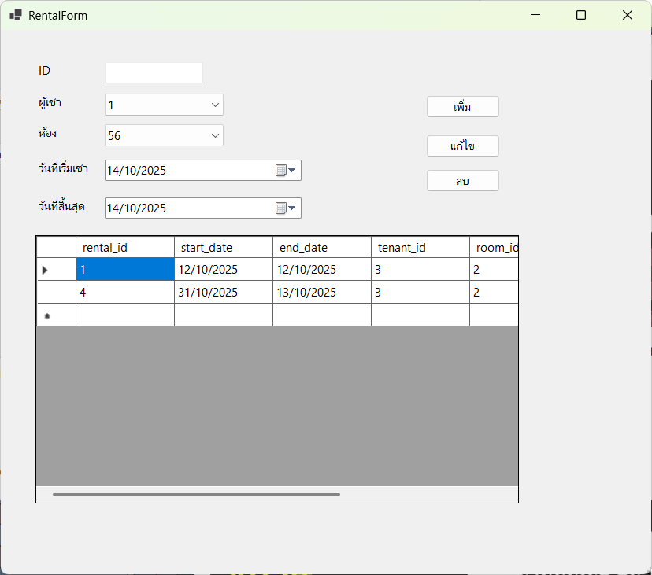
  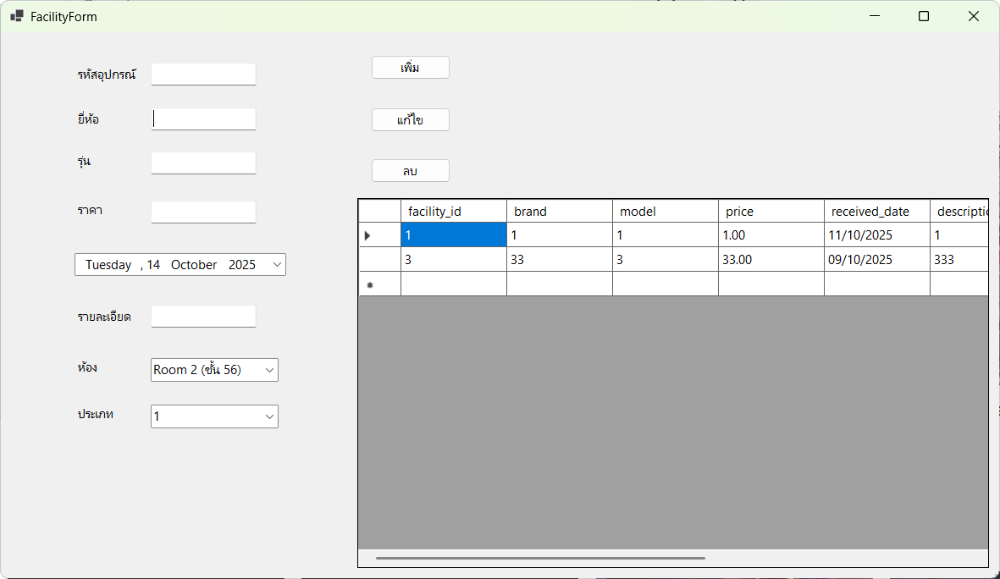
   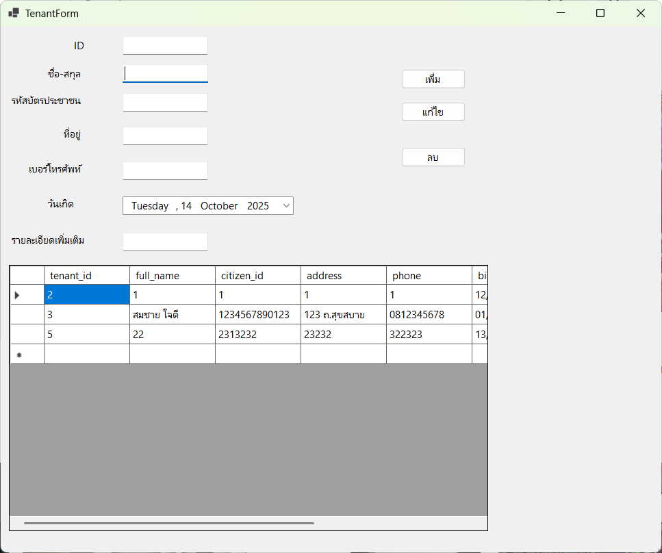
    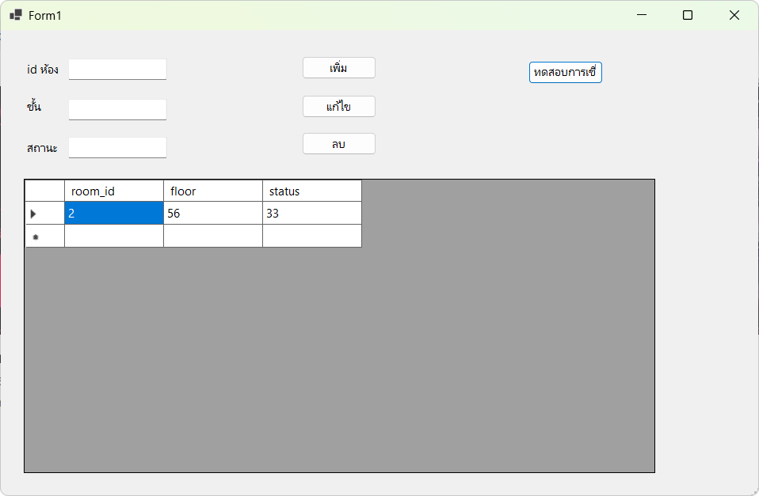
     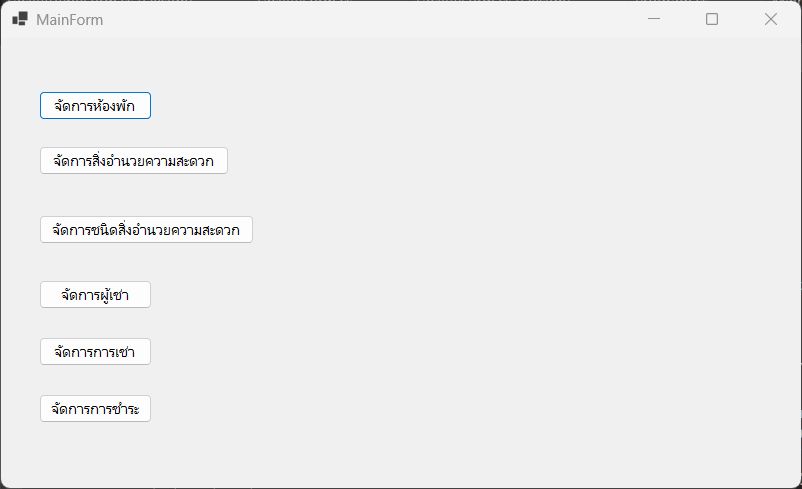
      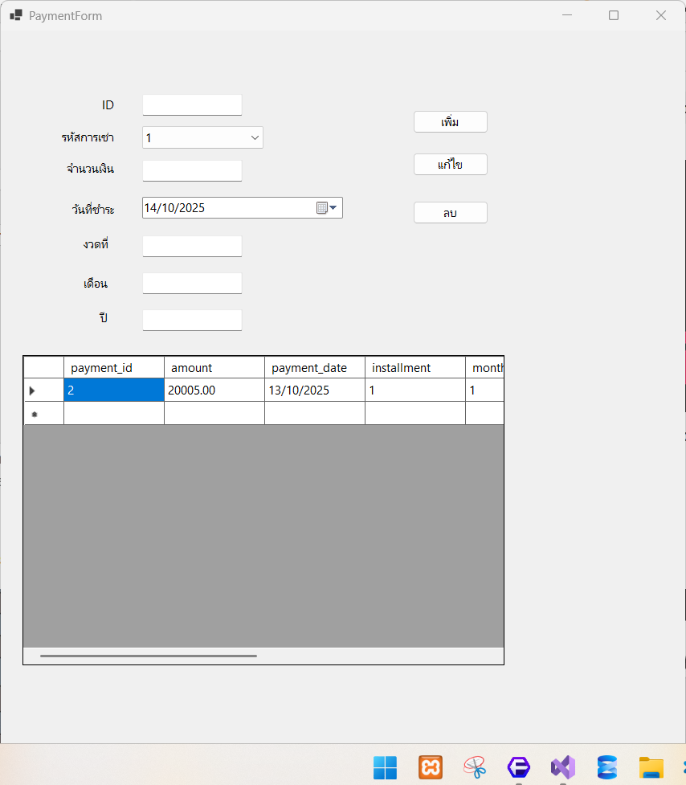
       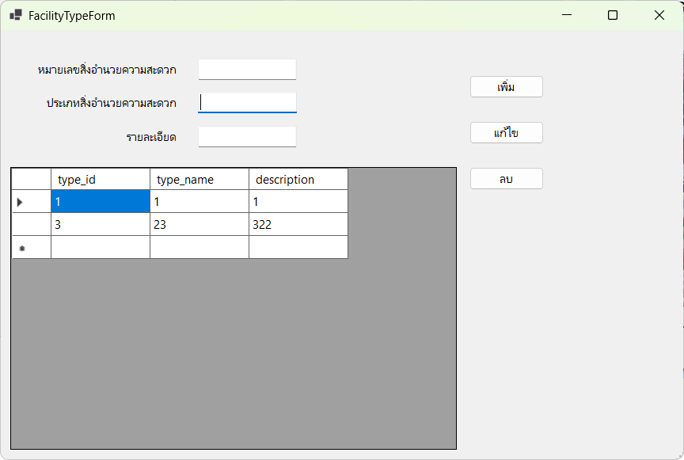

## ❌ การจัดการรวมกันแต่มันผิดที่อาจารย์ให้มา ตัวอย่าง 1 โปรแกรม = ระบบ เพิ่ม/ลบ/แก้ไข 
- ตัวอย่างที่ผิด
- 

 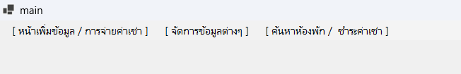
  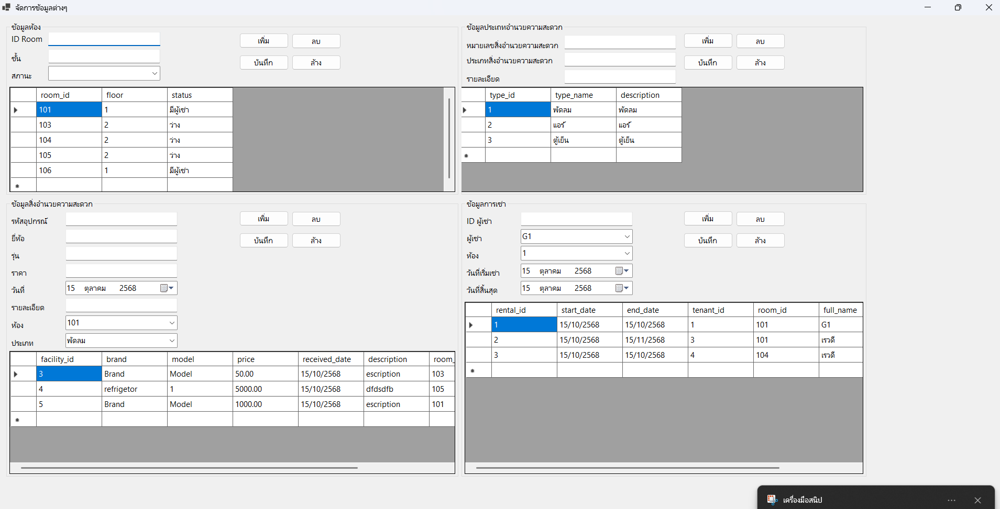
   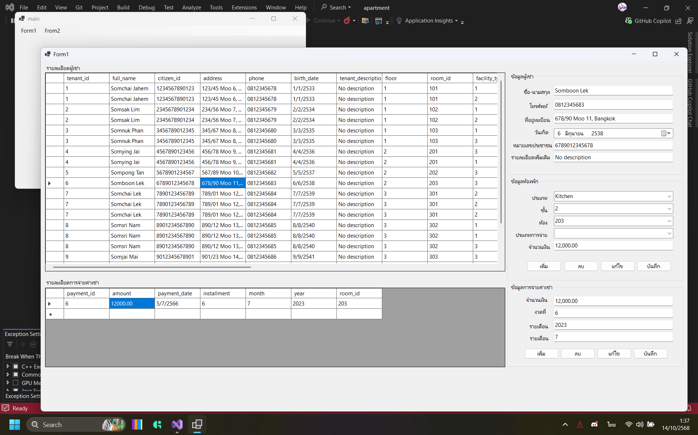
    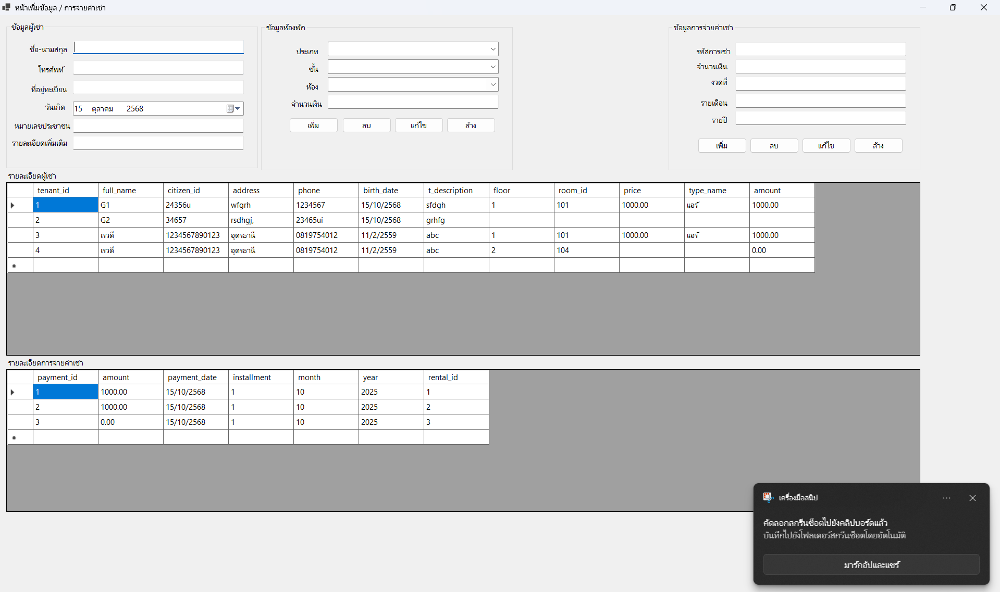

## ✨ วิธีดู SQL 

  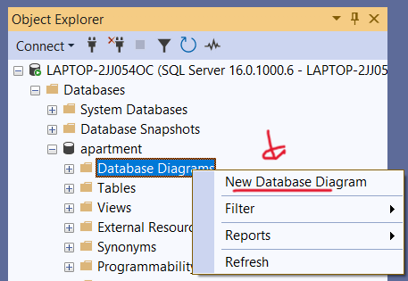
   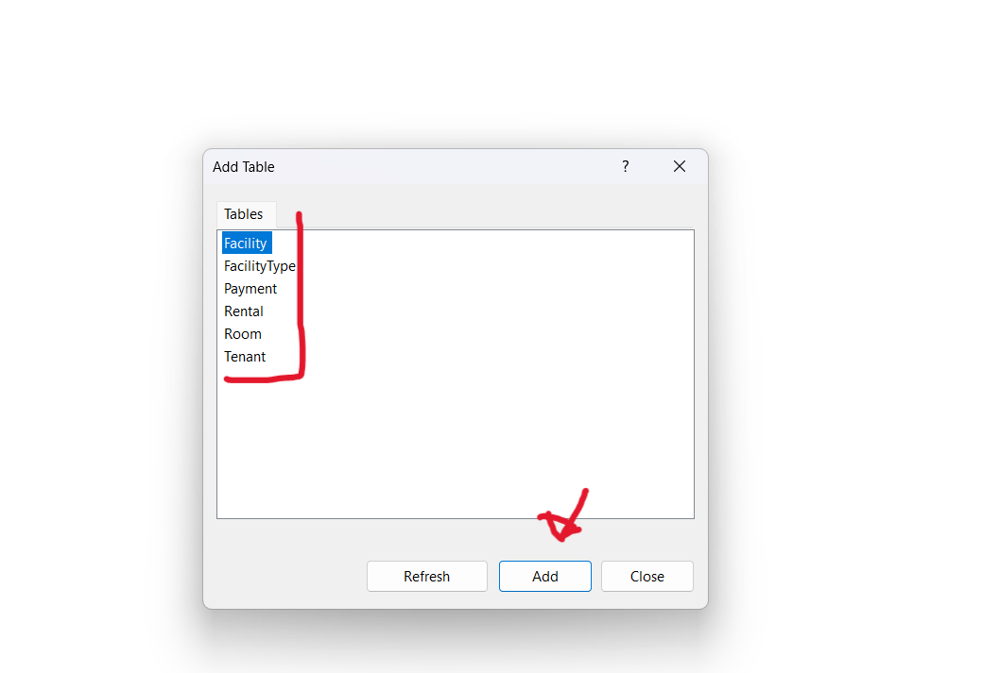
    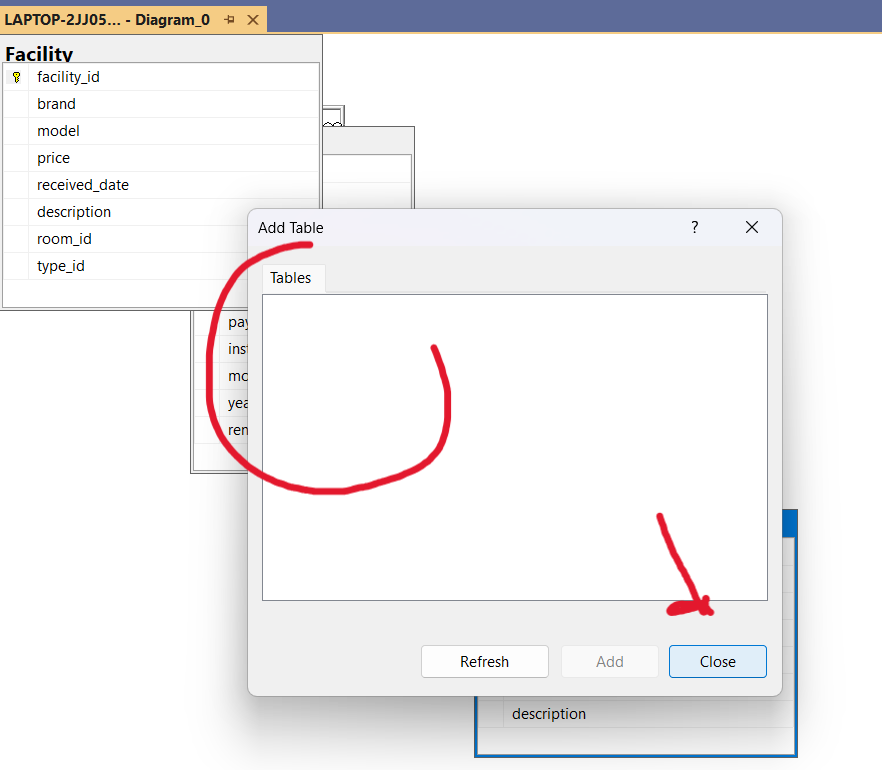
    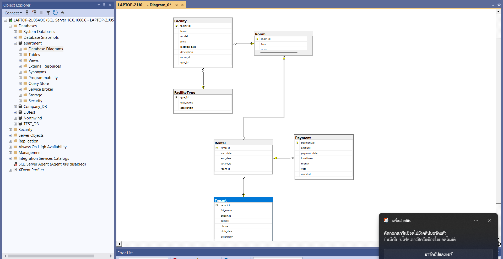

